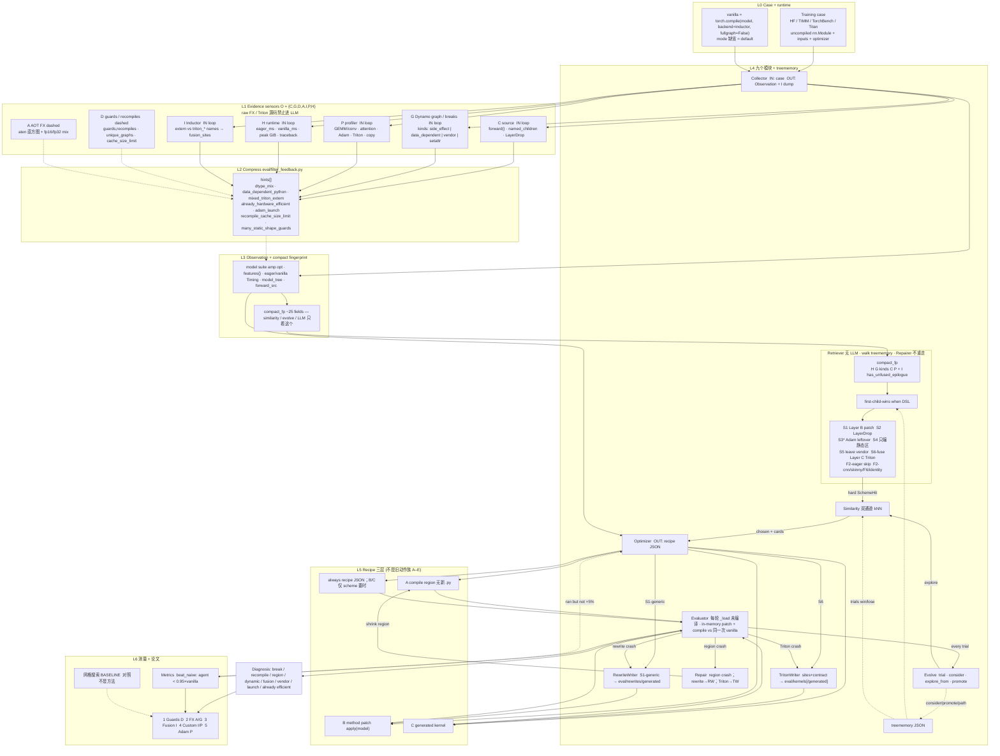

# 证据接到故事：框架图说明

源文件：

- **框架图**：[`evidence_to_story.dot`](evidence_to_story.dot) → [`evidence_to_story.png`](evidence_to_story.png)
- **检索图**：[`retrieve_scheme.dot`](retrieve_scheme.dot) → [`retrieve_scheme.png`](retrieve_scheme.png)
- **loop 图**：[`loop_evolve.dot`](loop_evolve.dot) → [`loop_evolve.png`](loop_evolve.png)
- **证据图**：[`evidence_channels.dot`](evidence_channels.dot) → [`evidence_channels.png`](evidence_channels.png)
- Agent I/O：[`agent_io.dot`](agent_io.dot) → [`agent_io.png`](agent_io.png)
- 模块 I/O 表：[`io_agent_table.md`](io_agent_table.md)

约定：实线 = 已进 `agent/loop.py` 闭环；虚线 = 工具已有、尚未作为 Retriever 检索键。**I 通道名字现已进检索**（`has_unfused_epilogue` → S6-fuse）。vanilla = `torch.compile(model, backend="inductor", fullgraph=False)`，**mode 缺省（default）**。



## 怎么读

1. **L1 不要把 raw dump 画成 agent 输入。** C/G/P/H/**I 名字**已经进 Collector；D/A 仍虚线（D 只给 recipe 上的 `mark_dynamic`，不是 walk 谓词）。Triton 源码不进 LLM。
2. **L4 九个模块。** Retriever 仍选方案名；S1 走 Layer B（catalog / `allow_logging` / RewriteWriter）；S6-fuse 是 Layer C「compile/厂商没覆盖的融合洞」，**不是**必须赢过 cuBLAS。rewrite 报错回 RewriteWriter；Triton 报错回 TritonWriter；其它 compile 报错走 Repair 一次再 explore。轨迹是本 run 的 `tried[]` / `paths`。
3. **L5 三层（论文 Layer A/B/C）。** 不要画成旧动作族 A–E。A = 编译区域（含 skip / leave vendor / `mark_dynamic`），不写新 `.py`；B = 内存方法补丁，永不覆盖 disk `model.py`；C = 生成 Triton。每轮 recipe 不叠：Evaluator `_load` 新的未编译模型，对照仍是 collect 那一次 vanilla。
4. **L6 网格搜索用虚线**（negative control）。
5. **每条 paper story 必须指回 L1 某一格，并用 Layer A/B/C 写动作。** Fusion 故事是 generate Triton，不只是「停手别改 Flash」。

```bash
cd ${GKO}
for f in evidence_to_story retrieve_scheme loop_evolve agent_io evidence_channels; do
  dot -Tsvg "graph/${f}.dot" -o "graph/${f}.svg"
  dot -Tpng -Gdpi=160 "graph/${f}.dot" -o "graph/${f}.png"
done
```
